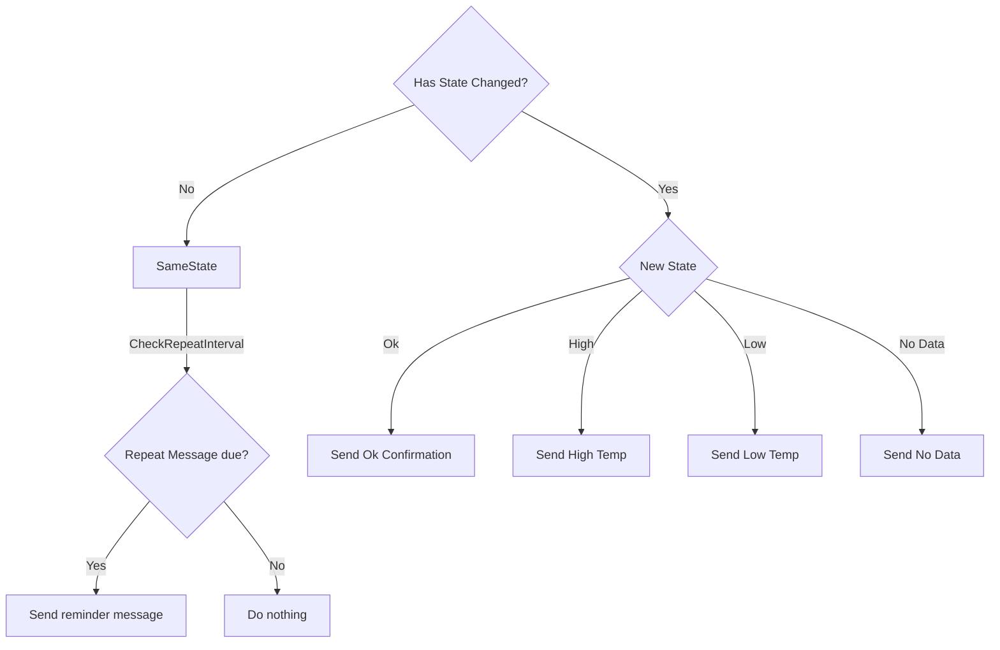

# Coldchain

Coldchain is designed to work with mSupply's Coldchain Application.
https://docs.msupply.foundation/coldchain/introduction/

## Installation

Configure notify to use a postgres database that's receiving cold chain data from mSupply.

## Logic

Here's the state diagram summarising the logic of the cold chain alerts.

