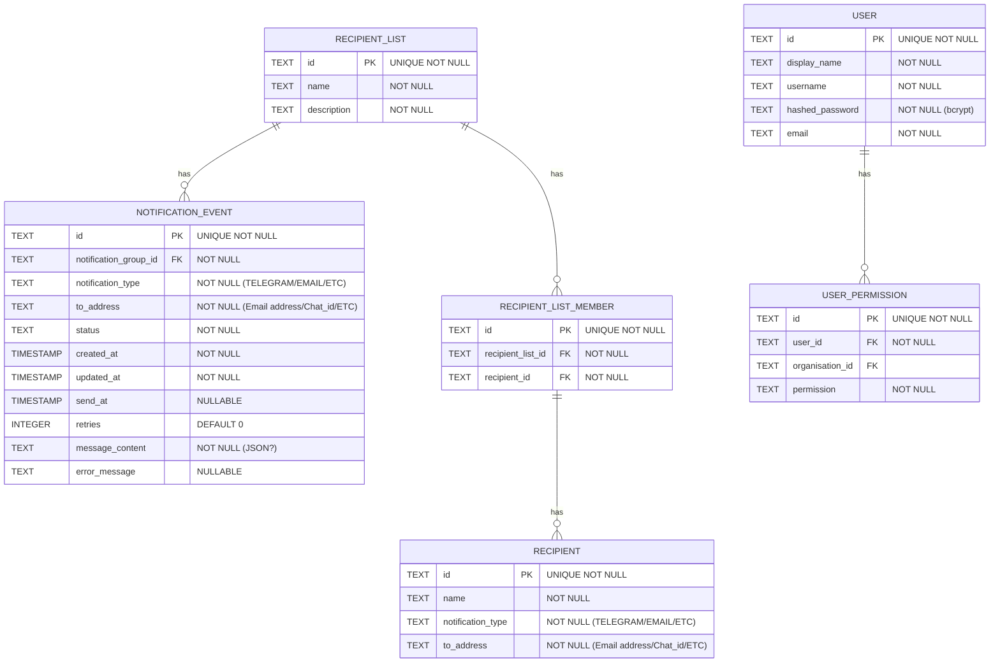

# Notify Schema

Please look at the code to confirm schema as this might not be fully up to date.
It should provide an overview of the concepts though...

Conceptually, I'm thinking that notification groups could be created linking members from a query (e.g. all mSupply users with permission to a particular store)
We might implement it different ways, e.g. with an SQL query in the group itself, or maybe there's a process that refreshes the group members from a query on a schedule?
For MVP, we'll create of groups and members manually.

