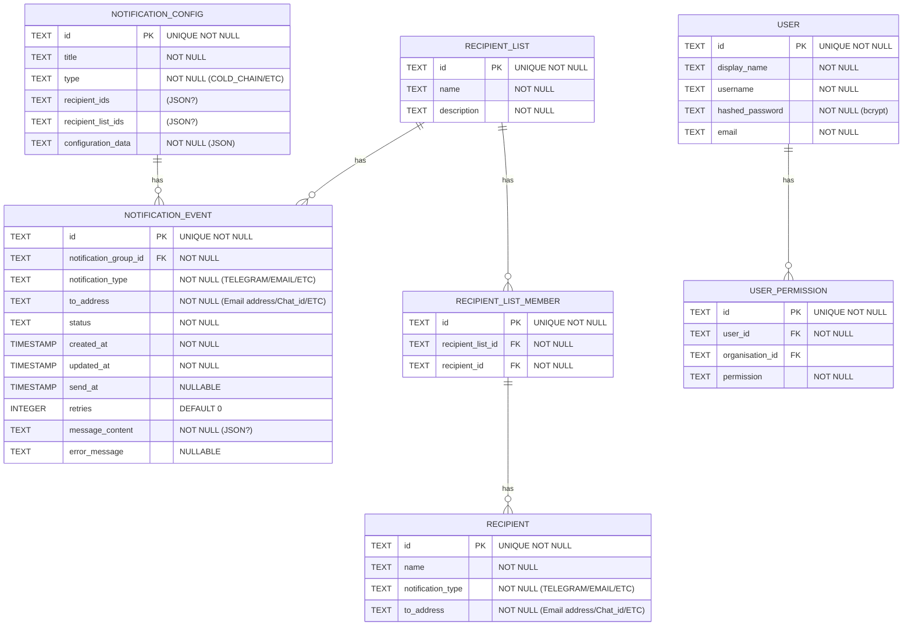

# Notify Schema

Please look at the code to confirm schema as this might not be fully up to date.
This file should be considerd a guide only.

## Notification Events
Notification Events are used to record and track notifications sent by the system.
Eventually we'll build a UI to view these events and their status.
The system will also use this table to retry sending notifications that fail.
Each record will relate to a single notification sent to a single recipient.
> Note: Longer term we'll probably need to think about archiving old events.

> Note: Each notification event can be linked to a Notification Config. I've made this nullable just incase we want to send a notification that isn't linked to a config for some reason. Maybe even test notifications will be recorded here, which feels like a possible use case.

## Notification Config
Notification Config is used to store the "common" configuration for a notification. This includes things like a title, and who the messages should be sent to. Conceptually we want to allow different notication types to be managed via plugins. Based on the notication type, the "plugin" will be able to save all it's configuration in the `configuration_data` field. This will allow us to add new notification types without having to change the schema.
Some plugins might need or want to create and manage their own schema, but this should provide a good starting point.

