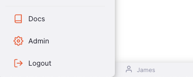

# So you want to add a new field?

Let's get started!

For this tutorial we'll assume we're wanting to add a `nickname` field to the user account.
When the user logs in, if they have nickname set, we want to display it in the bottom of the screen where their display name is shown.

Instead of following this tutorial exactly you might like to experiment with adding something else such as an address or phone number to extend your learning.

## Background Information

The Notify Server is broken up into two parts, frontend and backend.

The frontend is written in typescript and react, this is what displays the website users use to configure the system.
To get started with the frontend, see the [frontend README](../../frontend/README.md).

The backend is written in rust, using actix-web and diesel.
To get started with the backend, see the [backend README](../../backend/README.md).

For first up, we'll be focussing on the backend rust code.
To get started create a new branch of the code for your changes, open a terminal to the `backend` folder and run `cargo test --no-default-features` to make sure everything is ship shape to get started!

## Step 1: Adding the field to the database

In notify, we actually have two databases associated with the application.
One is called `datasource`, this crate is intended to be used in a read only mode to query data used in notifications, alerts, etc. We assume this database is Postgres, and might live on a completely different machine.

> Note: For this tutorial you won't need postgres, but if don't have it setup you will need to remember to run `cargo test --no-default-features` to ignore any connection errors from the postgres database.

The internal database used to manage the configuration is called `repository`, this is where we need to add the new field.

## Step 2: Add the field to `UserAccountRow` in the `repository` crate

## Step 3: Add the field to `UserAccountService` structs in the `service` crate

## Step 4: Add the field to `UserAccountNode` in the `graphql_types` crate

## Step 5: Add the field to `UserAccountEditForm` in `frontend`

## Step 6: Admire your success!
